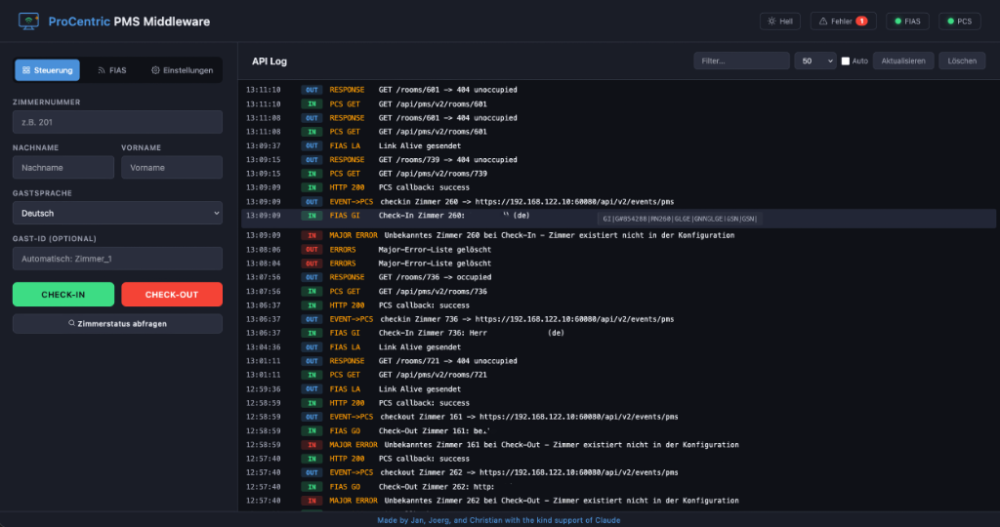

# ProCentric PMS Middleware

Middleware-Bruecke zwischen **Fidelio Opera PMS** (per FIAS-TCP-Protokoll) und **LG ProCentric Direct Server (PCS)** (per REST-API).
Sie nimmt Check-In/Check-Out- und Gastdaten-Events von Opera entgegen, leitet sie an die TV-Steuerung weiter und bietet eine Web-GUI fuer manuelle Bedienung, Diagnose und Konfiguration.



## Funktionen

- **FIAS-TCP-Client** (Daemon) - Persistente Verbindung zum Opera FIAS-Port, empfaengt `GI` / `GO` / `GC`-Records und reicht sie an PCS weiter.
- **PMS Interface Server** (Port 7000) - HTTP-Endpunkte, die PCS abfragt (`/check`, `/details`, `/rooms/{id}`, `/subscriptions`, `/checkouts`, `/folios`, `/statuses`).
- **Web-GUI** (Port 80) - Manuelles Check-In/Check-Out, Zimmerstatus, FIAS-Daemon-Kontrolle, Konfiguration, Live-Log, Major-Error-Anzeige, Dunkel/Hell-Theme.
- **Tagesresync** (Cron) - Massen-Auscheck-/Einchecken aller Zimmer als FIAS-Fallback.
- **Auto-Discovery** - Zimmerliste wird waehrend des PCS-„Fetch Settings" automatisch ergaenzt.
- **Sprach-Uebersetzungstabelle** - FIAS-Codes (`EA`, `GE`, ...) -> PCS-Codes (`en`, `de`, ...), editierbar in der GUI.
- **Major-Error-Tracking** - Fehlerhafte Zimmernummern, ungueltige Records etc. werden im GUI angezeigt.

## Architektur

```
+---------+   FIAS-TCP    +---------------------+   REST/JSON   +-------+   PCS-Push   +-----+
| Opera   | <===========> | fias_client.php     | ============> | PCS   | ===========> | TVs |
| PMS     |               | (systemd-Daemon)    |               |       |              |     |
+---------+               +---------------------+               +-------+              +-----+
                                    |                              ^
                                    | apiLog()                     | HTTP :7000
                                    v                              |
                          +---------------------+        +---------------------+
                          | logs/api.log        |        | pms_router.php      |
                          +---------------------+        | (Apache VHost)      |
                                    ^                    +---------------------+
                                    |
                          +---------------------+
                          | index.php / api.php |  <--- Browser (Port 80, IP-restricted)
                          +---------------------+
```

## Voraussetzungen

- Rocky/RHEL 9/10 (oder kompatibel) - andere Distros funktionieren, Pfade ggf. anpassen
- Apache `httpd` mit `mod_rewrite`
- PHP 8.x mit `php-cli`, `php-json`, `php-curl`, `php-sockets`
- `gcc`, `make` (fuer SUID-Hilfsbinary)
- Netzwerk-Zugriff zum Opera FIAS-Port (TCP 5091) und zum PCS-API-Port (TCP 60080)

## Installation

### 1. Pakete

```bash
dnf install -y httpd php php-cli php-curl php-json php-process gcc
systemctl enable --now httpd
```

### 2. Quellcode bereitstellen

```bash
git clone https://github.com/<USER>/procentric-pms-middleware.git
cd procentric-pms-middleware
sudo cp -r web/* web/.htaccess /var/www/html/
sudo cp web/config.example.json /var/www/html/config.json
sudo chown -R apache:apache /var/www/html
sudo mkdir -p /var/www/html/data /var/www/html/logs
sudo chown apache:apache /var/www/html/data /var/www/html/logs
```

### 3. Apache-VirtualHosts

```bash
sudo cp deploy/apache/pms-middleware.conf  /etc/httpd/conf.d/
sudo cp deploy/apache/port80-restrict.conf /etc/httpd/conf.d/
```

`port80-restrict.conf` enthaelt die erlaubten Quell-Netze fuer die GUI - bitte an dein Netz anpassen.
Dann den Listen-Port 7000 in `/etc/httpd/conf/httpd.conf` aktivieren:

```apache
Listen 80
Listen 7000
```

```bash
sudo systemctl restart httpd
```

### 4. FIAS-Daemon

```bash
sudo cp deploy/systemd/fias-client.service /etc/systemd/system/
sudo systemctl daemon-reload
sudo systemctl enable fias-client
sudo systemctl start fias-client
```

### 5. SUID-Hilfsbinary fuer Service-Steuerung aus der GUI

```bash
cd deploy/fias-ctl
gcc -O2 -o fias-ctl fias-ctl.c
sudo cp fias-ctl /usr/local/bin/
sudo chown root:root /usr/local/bin/fias-ctl
sudo chmod 4755 /usr/local/bin/fias-ctl
```

> **Hinweis:** Bei aktiviertem SELinux schlaegt der SUID-Aufruf aus Apache heraus fehl.
> Entweder eine SELinux-Policy bauen oder SELinux deaktivieren (`setenforce 0`, dann `SELINUX=disabled` in `/etc/selinux/config`).

### 6. Cron fuer taeglichen Resync

```bash
sudo cp deploy/cron/pms-middleware /etc/cron.d/pms-middleware
sudo systemctl restart crond
```

Default: Checkout um 11:00, Checkin um 11:30. In der Datei aenderbar.

### 7. Konfiguration

Die GUI auf `http://<server>/` oeffnen und im Tab **Einstellungen** ausfuellen:

- **ProCentric Server**: Host/Port/SSL des PCS, Client-ID + Secret
- **FIAS**: Host/Port des Opera-FIAS-Servers, Heartbeat-Intervall (Default 300s)
- **Sprach-Tabelle**: Mapping FIAS-Code → PCS-Code (Default bereits gefuellt)
- **Resync**: Aktivierung, Uhrzeiten, Pseudo-Gast fuer Mass-Checkin

Alternativ direkt in `/var/www/html/config.json` editieren.

## Bedienung

- **Steuerung**: Manuelles Check-In/Check-Out, Zimmerstatus abfragen
- **FIAS**: Daemon Start/Stop, DB-Swap anfordern, Status pruefen
- **Einstellungen**: Server-Konfiguration, Resync-Trigger, Verbindungstest

Oben rechts:
- **Fehler-Badge** mit Major-Errors
- **FIAS/PCS-Statusanzeige** mit Tooltip „Letzter Check"
- **Theme-Toggle** Dunkel/Hell

Das Live-Log unten zeigt alle ein- und ausgehenden Events farbcodiert. Klick auf einen Eintrag öffnet die Roh-Daten.

## Wichtige Hinweise zur FIAS-Verbindung

- Der FIAS-Server akzeptiert **nur eine TCP-Verbindung**. Eine zweite eingehende Verbindung schliesst die erste. Daher: keine zusaetzlichen `fsockopen`/`telnet`-Tests gegen den FIAS-Port, solange der Daemon laeuft.
- Der Daemon initiiert die Verbindung, **wartet auf das `LS` der Gegenstelle** und antwortet mit `LD` + `LR` + `LA` in einem einzigen Write (ohne Pausen).
- Non-blocking Socket + `socket_select`, damit der periodische `LA`-Heartbeat (Default 300s) auch waehrend Read-Pausen gesendet wird.

## Sicherheit

- GUI-Zugriff per `port80-restrict.conf` auf Admin-Netze begrenzen.
- `.htaccess` schuetzt `config.json`, `*.log`, `*.pid`, interne PHP-Dateien sowie `data/` und `logs/` vor direktem Zugriff.
- Die `config.json` enthaelt PCS-Credentials - **nicht** ins Repo einchecken (steht in `.gitignore`).

## Projektstruktur

```
.
+-- LICENSE                 # GNU GPL v3
+-- README.md
+-- docs/
|   +-- PCS.png             # Screenshot der GUI
+-- web/                    # Inhalt fuer /var/www/html/
|   +-- api.php             # GUI-Backend
|   +-- pms_router.php      # PCS-facing API (Port 7000)
|   +-- fias_client.php     # FIAS-TCP-Daemon
|   +-- resync.php          # Resync (PCS-API-Variante)
|   +-- resync_lib.php      # Resync (subscription-callback-Variante)
|   +-- resync_cron.php     # Cron-Runner
|   +-- index.php           # Web-GUI (Dunkel/Hell-Theme)
|   +-- .htaccess           # Datei-/Verzeichnisschutz
|   +-- config.example.json # Konfigurationsvorlage
+-- deploy/
    +-- systemd/fias-client.service
    +-- apache/{pms-middleware.conf, port80-restrict.conf}
    +-- cron/pms-middleware
    +-- fias-ctl/fias-ctl.c   # SUID-Hilfsbinary
```

## Lizenz

Dieses Projekt steht unter der **GNU General Public License v3.0** - siehe [LICENSE](LICENSE).
